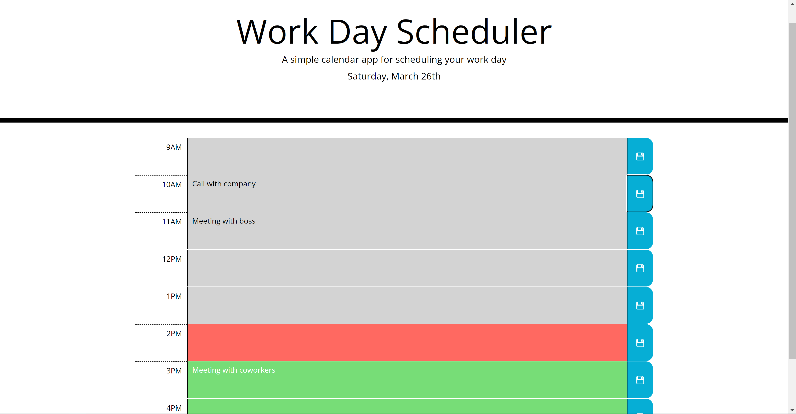

# work-day-scheduler

## Description

**Goal:** To create a calendar application that allows a user to save events for each hour of the work day.

The busier you are, the more difficult it can be to keep track of your schedule and manage your time effectively. This calendar uses a small scope of one day to schedule important events. It marks each hour by past, present, and future.

## Development

1. Wireframed time block structure and class structure.
1. Adjusted CSS properties.
1. Appended current date to page.
1. Created time block row and all elements inside for each hour of the work day.
1. Added classes to each hour to determine past, present, future.
1. Added local storage functionality to keep track of events across page refreshes.

## Deployment

[Deployed Webpage](https://supsha878.github.io/work-day-scheduler/)